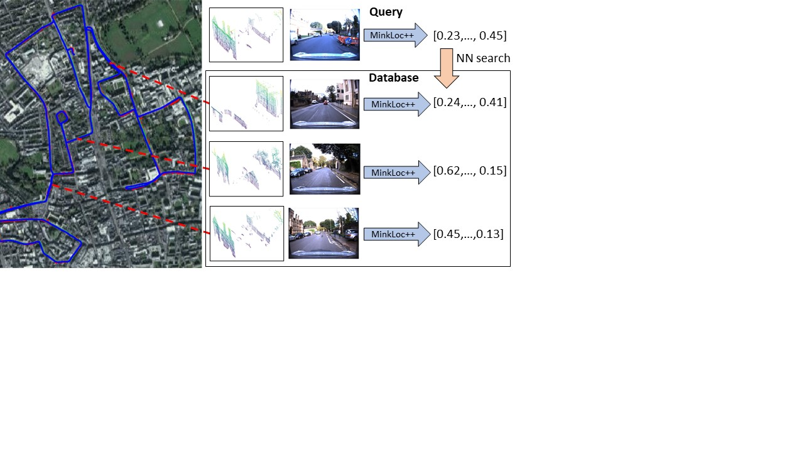

# MinkLoc++: Lidar and Monocular Image Fusion for Place Recognition

Paper: [MinkLoc++: Lidar and Monocular Image Fusion for Place Recognition](https://ieeexplore.ieee.org/document/9533373) 
accepted for International Joint Conference on Neural Networks (IJCNN) 2021
[ArXiv](https://arxiv.org/pdf/2104.05327.pdf) 

[Jacek Komorowski](mailto:jacek.komorowski@pw.edu.pl), Monika Wysoczańska, Tomasz Trzciński

Warsaw University of Technology

For our point cloud-based global descriptor see [MinkLoc3D (WACV 2021)](https://github.com/jac99/MinkLoc3D).



### Introduction
We present a discriminative multimodal descriptor based on a pair of sensor readings: a point cloud from a LiDAR and an image from an RGB camera.
Our descriptor, named MinkLoc++, can be used for place recognition, re-localization and loop closure purposes in robotics or autonomous vehicles applications.
We use late fusion approach, where each modality is processed separately and fused in the final part of the processing pipeline.
The proposed method achieves state-of-the-art performance on standard place recognition benchmarks.
We also identify dominating modality problem when training a multimodal descriptor. 
The problem manifests itself when the network focuses on a modality with a larger overfit to the training data. This drives the loss down during the training but leads to suboptimal performance on the evaluation set.
In this work we describe how to detect and mitigate such risk when using a deep metric learning approach to train a multimodal neural network.
### Citation
If you find this work useful, please consider citing:

    @INPROCEEDINGS{9533373,  
       author={Komorowski, Jacek and Wysoczańska, Monika and Trzcinski, Tomasz},  
       booktitle={2021 International Joint Conference on Neural Networks (IJCNN)},   
       title={MinkLoc++: Lidar and Monocular Image Fusion for Place Recognition},   
       year={2021},  
       doi={10.1109/IJCNN52387.2021.9533373}
    }

### Environment and Dependencies
Code was tested using Python 3.8 with PyTorch 1.9.1 and MinkowskiEngine 0.5.4 on Ubuntu 20.04 with CUDA 10.2.

The following Python packages are required:
* PyTorch (version 1.9.1 or above)
* MinkowskiEngine (version 0.5.4)
* pytorch_metric_learning (version 0.9.99 or above)
* tensorboard


Modify the `PYTHONPATH` environment variable to include absolute path to the project root folder: 
```export PYTHONPATH
export PYTHONPATH=$PYTHONPATH:/home/.../MinkLocMultimodal
```

### Datasets

**MinkLoc++** is a multimodal descriptor based on a pair of inputs:
- a 3D point cloud constructed by aggregating multiple 2D LiDAR scans from Oxford RobotCar dataset, 
- a corresponding RGB image from the stereo-center camera.

We use 3D point clouds built by authors of *PointNetVLAD: Deep Point Cloud Based Retrieval for Large-Scale Place Recognition* paper ([link](https://arxiv.org/pdf/1804.03492)).
Each point cloud is built by aggregating 2D LiDAR scans during the 20 meter vehicle traversal.
For details see PointNetVLAD paper or their github repository ([link](https://github.com/mikacuy/pointnetvlad)).
You can download training and evaluation point clouds from 
[here](https://drive.google.com/open?id=1rflmyfZ1v9cGGH0RL4qXRrKhg-8A-U9q) 
([alternative link](https://drive.google.com/file/d/1-1HA9Etw2PpZ8zHd3cjrfiZa8xzbp41J/view?usp=sharing)). 

RGB images are taken directly from Oxford RobotCar dataset. 
First, you need to download stereo camera images from Oxford RobotCar dataset.
See dataset website for details ([link](https://robotcar-dataset.robots.ox.ac.uk)).
After downloading the dataset, run ```generate_rgb_for_lidar.py``` script that finds 20 closest RGB images in RobotCar 
dataset for each 3D point cloud, downsamples them and saves them in the target directory. 
During the training an input to the network consists of a 3D point cloud and one RGB image randomly chosen 
from these 20 corresponding images.
During the evaluation, a network input consists of a 3D point cloud and one RGB image with the closest timestamp.

Before the network training or evaluation, run the below code to generate training pickles (with positive and negative point 
clouds for each anchor point cloud) and evaluation pickles. Training pickle format is optimized and different from the 
format used in PointNetVLAD code. 
 
```generate pickles
cd generating_queries/ 

# Generate training tuples for the Baseline Dataset
python generate_training_tuples_baseline.py --dataset_root <dataset_root_path>

# Generate training tuples for the Refined Dataset
python generate_training_tuples_refine.py --dataset_root <dataset_root_path>

# Generate evaluation tuples
python generate_test_sets.py --dataset_root <dataset_root_path>
```
`<dataset_root_path>` is a path to dataset root folder, e.g. `/data/pointnetvlad/benchmark_datasets/`.
Before running the code, ensure you have read/write rights to `<dataset_root_path>`, as training and evaluation pickles
are saved there. 

### Training

**MinkLoc++** can be used in unimodal scenario (3D point cloud input only) and multimodal scenario (3D point cloud + RGB image input).
To train **MinkLoc++** network, download and decompress the 3D point cloud dataset and generate training pickles as described above.
To train the multimodal model (3D+RGB) download the original Oxford RobotCar dataset 
and extract RGB images corresponding to 3D point clouds as described above.
Edit the configuration files:
- `config_baseline_multimodal.txt` when training a multimodal (3D+RGB) model 
- `config_baseline.txt` and `config_refined.txt` when train unimodal (3D only) model

Set `dataset_folder` parameter to the dataset root folder, where 3D point clouds are located.
Set `image_path ` parameter to the path with RGB images corresponding to 3D point clouds, extracted from 
Oxford RobotCar dataset using ```generate_rgb_for_lidar.py``` script (only when training a multimodal model).
Modify `batch_size_limit` parameter depending on the available GPU memory. 
Default limits requires 11GB of GPU RAM.

To train the multimodal model (3D+RGB), run:

```train multimodal (3D+RGB) model
cd training

python train.py --config ../config/config_baseline_multimodal.txt --model_config ../models/minklocmultimodal.txt
```

To train a unimodal model (3D only) model run:

```
cd training

# Train unimodal (3D only) model on the Baseline Dataset
python train.py --config ../config/config_baseline.txt --model_config ../models/minkloc3d.txt

# Train unimodal (3D only) model on the Refined Dataset
python train.py --config ../config/config_refined.txt --model_config ../models/minkloc3d.txt
```

### Pre-trained Models

Pretrained models are available in `weights` directory
- `minkloc_multimodal.pth` multimodal model (3D+RGB) trained on the Baseline Dataset with corresponding RGB images 
- `minkloc3d_baseline.pth` unimodal model (3D only) trained on the Baseline Dataset 
- `minkloc3d_refined.pth` unimodal model (3D only) trained on the Refined Dataset 

### Evaluation

To evaluate pretrained models run the following commands:

```
cd eval

# To evaluate the multimodal model (3D+RGB only) trained on the Baseline Dataset
python evaluate.py --config ../config/config_baseline_multimodal.txt --model_config ../models/minklocmultimodal.txt --weights ../weights/minklocmultimodal_baseline.pth

# To evaluate the unimodal model (3D only) trained on the Baseline Dataset
python evaluate.py --config ../config/config_baseline.txt --model_config ../models/minkloc3d.txt --weights ../weights/minkloc3d_baseline.pth

# To evaluate the unimodal model (3D only) trained on the Refined Dataset
python evaluate.py --config ../config/config_refined.txt --model_config ../models/minkloc3d.txt --weights ../weights/minkloc3d_refined.pth
```

## Results

**MinkLoc++** performance (measured by Average Recall@1\%) compared to the state of the art:

### Multimodal model (3D+RGB) trained on the Baseline Dataset extended with RGB images

| Method         | Oxford (AR@1) | Oxford (AR@1\%) | 
|---------------|-------|-------|
| CORAL [1] | 88.9 | 96.1 |   
| PIC-Net [2] |     | 98.2   |  
| **MinkLoc++ (3D+RGB)**  | 96.7 | 99.1 |      

### Unimodal model (3D only) trained on the Baseline Dataset

| Method         | Oxford (AR@1\%) | U.S. (AR@1\%) | R.A. (AR@1\%) | B.D (AR@1\%) |
| ------------------|----------------|--------------|------|------|
| PointNetVLAD [3] |     80.3     |   72.6 | 60.3 | 65.3 |
| PCAN [4] |     83.8     |   79.1 | 71.2 | 66.8 |
| DAGC [5] |     87.5     |   83.5 | 75.7 | 71.2 |
| LPD-Net [6] |     94.9   |   96.0 | 90.5 | **89.1** |
| EPC-Net [7] |     94.7   |   **96.5** | 88.6 | 84.9 |
| SOE-Net [8] |     96.4   |   93.2 | 91.5 | 88.5 |
| NDT-Transformer [10] | 97.7 | | | |
| MinkLoc3D [9] |     97.9     |   95.0 | 91.2 | 88.5 |
| **MinkLoc++ (3D-only)** |   **98.2** |  94.5  | **92.1** | 88.4 |


### Unimodal model (3D only) trained on the Refined Dataset

| Method         | Oxford  (AR@1\%) | U.S. (AR@1\%) | R.A. (AR@1\%) | B.D (AR@1\%) |
| ------------------ |---------------- | -------------- |---|---|
| PointNetVLAD [3] |     80.1     |   94.5 | 93.1 | 86.5 |
| PCAN [4] |     86.4     |   94.1 | 92.3 | 87.0 |
| DAGC [5] |     87.8     |   94.3 | 93.4 | 88.5 |
| LPD-Net [6] |     94.9     |   98.9 | 96.4 | 94.4 |
| SOE-Net [8] |     96.4   |   **97.7** | 95.9 | 92.6 |
| MinkLoc3D [9] |     **98.5**     |   **99.7** | **99.3** | 96.7 |
| **MinkLoc++ (RGB-only)**  |  98.4 | **99.7** | **99.3** | **97.4** |

1. Y. Pan et al., "CORAL: Colored structural representation for bi-modal place recognition", preprint arXiv:2011.10934 (2020)
2. Y. Lu et al., "PIC-Net: Point Cloud and Image Collaboration Network for Large-Scale Place Recognition", preprint arXiv:2008.00658 (2020)
3. M. A. Uy and G. H. Lee, "PointNetVLAD: Deep Point Cloud Based Retrieval for Large-Scale Place Recognition", 2018 IEEE/CVF Conference on Computer Vision and Pattern Recognition (CVPR)
4. W. Zhang and C. Xiao, "PCAN: 3D Attention Map Learning Using Contextual Information for Point Cloud Based Retrieval", 2019 IEEE/CVF Conference on Computer Vision and Pattern Recognition (CVPR)
5. Q. Sun et al., "DAGC: Employing Dual Attention and Graph Convolution for Point Cloud based Place Recognition", Proceedings of the 2020 International Conference on Multimedia Retrieval
6. Z. Liu et al., "LPD-Net: 3D Point Cloud Learning for Large-Scale Place Recognition and Environment Analysis", 2019 IEEE/CVF International Conference on Computer Vision (ICCV)
7. L. Hui et al., "Efficient 3D Point Cloud Feature Learning for Large-Scale Place Recognition" preprint arXiv:2101.02374 (2021)
8. Y. Xia et al., "SOE-Net: A Self-Attention and Orientation Encoding Network for Point Cloud based Place Recognition", 2021 IEEE/CVF Conference on Computer Vision and Pattern Recognition (CVPR)
9. J. Komorowski, "MinkLoc3D: Point Cloud Based Large-Scale Place Recognition", Proceedings of the IEEE/CVF Winter Conference on Applications of Computer Vision (WACV), (2021)
10. Z. Zhou et al., "NDT-Transformer: Large-scale 3D Point Cloud Localisation Using the Normal Distribution Transform Representation", 
   2021 IEEE International Conference on Robotics and Automation (ICRA)
* J. Komorowski, M. Wysoczanska, T. Trzcinski, "MinkLoc++: Lidar and Monocular Image Fusion for Place Recognition", accepted for International Joint Conference on Neural Networks (IJCNN), (2021)

### License
Our code is released under the MIT License (see LICENSE file for details).
